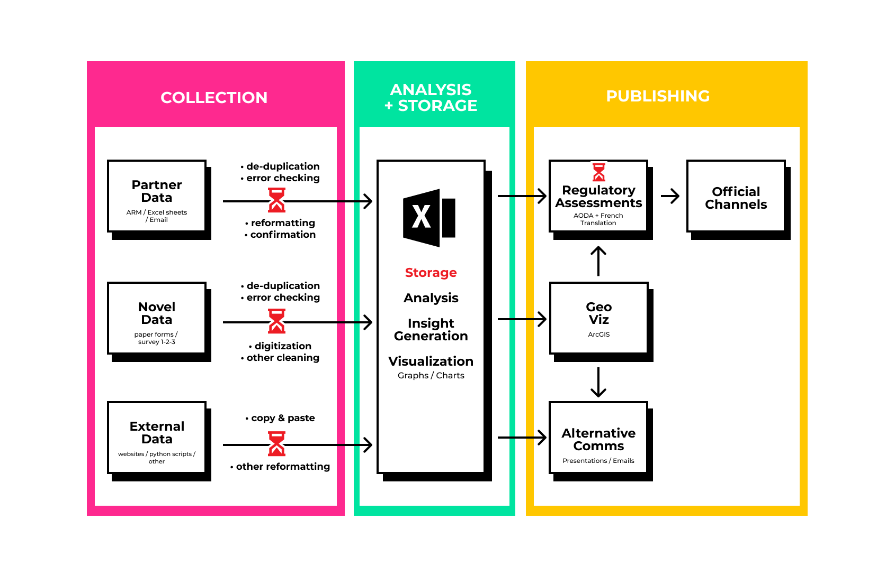
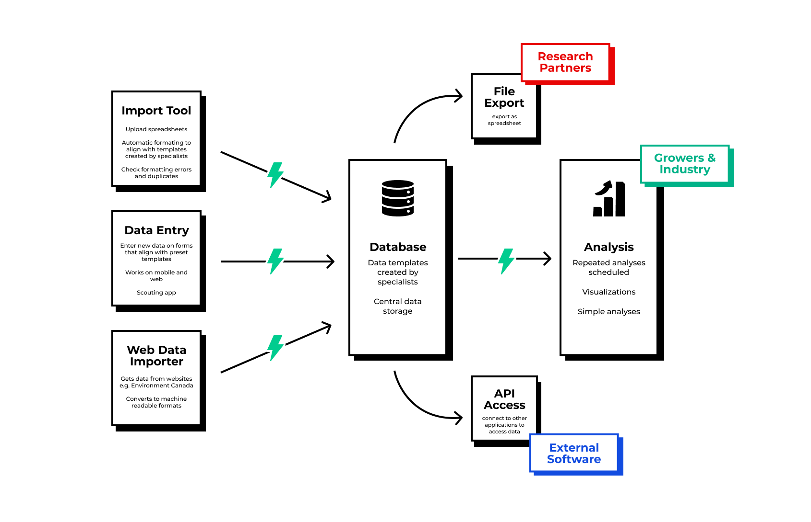
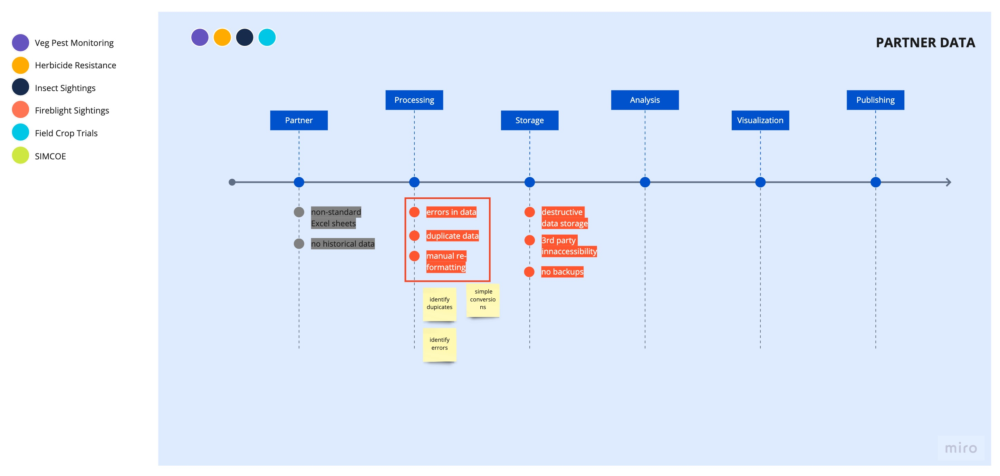
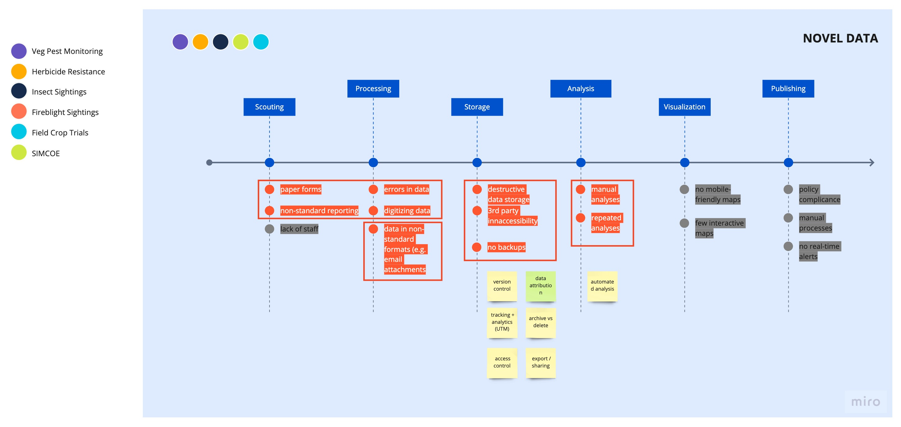
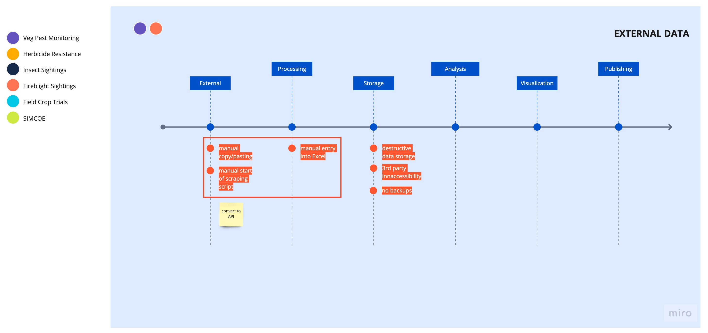

# Components Overview

## Problem Space Recap
Because of challenges in collecting and analysing data it is difficult for specialists to generate important insights and share them with growers. Due to this, growers don’t always have access to the tools necessary to respond to threats in real-time.

*   **Collection Phase**
    *   Outdated or incorrect tools
    *   Manual Processes
*   **Analysis & Storage**
    *   Excel used as both storage and analysis
    *   Manual processes
    *   Lack of resources
*   **Publishing and Distribution**
    *   Outdated or incorrect tools
    *   Manual Processes
    *   Insufficient support in implementing Policy

## Solution Overview
The vision for Ceres is to overhaul the data management processes of the client by providing tooling for each phase of the problem space. Each section is self-containing and can be built to integrate with current workflows so as to ensure continuity as the client continues to deliver services.

Our solution focuses on the first 2 phases as multiple solutions are being developed for the third.
  

### Collection Phase
#### For Partner and Historical Data

A conversion tool that takes historical data and converts it to a data structure as outlined above
1. The user should be able to upload a simple spreadsheet exports (e.g. CSV files) to the database with this tool
2. The user should be able to use the software to identify which columns on the spreadsheet/table contain data for specific fields of the pre-set data structure
3. The tool should be able to import the data and make simple conversions where necessary e.g. date format conversions, address enrichment or degradation etc
4. The tool should be able to identify duplicate data, data that is incompatible with the predetermined data structure, as well as gaps with the data, and flag them for action by the user
  
  
#### For Novel Data

A data entry tool that will allow users submit novel data in line with preset data structures at the point of observation or soon after
1. The tool should be able to provide simple data validation at the point of entry, aiming to eliminate errors in the data stored and used for analysis
2. The tool should be able to download updated data structures from the storage application and present them to users
3. Users should be able to use the tool via
    1. **Mobile** - with a scouting app. This app should have an offline mode for no-bandwidth or low-bandwidth situations
    2. **Web (responsive for mobile)** 
  
  
#### For External Data (e.g. Weather Data)
_OMAFRA has a team working on building a solution to collect weather data directly. This covers an approach that we would take._

  
  
### Storage and Analysis Phase 
#### For Storage
A database solution that has the following features
1. Users can create a data structure - detailing the names of the data fields and the type of data they can contain
2. Users can create field types (data objects) from primitives that can be used as field types in creating data structures
3. Users can search within the database for data based on specific parameters. Data searches are not limited to single datasets, or to data they themselves have uploaded
4. Users can manage data within the database with a graphic user interface
5. Users can export data based on specific parameters in formats interoperable by most analysis programs. Data exports are not limited to single datasets, or to data they themselves have uploaded. Data can be exported in two ways:
    1. As a file export e.g. .csv file format
    2. Via authenticated API API
6. Data can be saved on the database in alignment with pre-selected/pre-created data structures either by:
    3. A data entry tool 
    4. A data importation tool
    5. An API
  
    
#### For Analysis
A tool that allows users set up and run repeated analyses with new data as it is received
1. Users should be able to set up parameters for repeated analyses
2. Users should be able to set triggers for automated analyses
3. Tool should generate visualisations for these analyses exportable in various formats - image (e.g .jpg, .png) or document (e.g. .pdf)